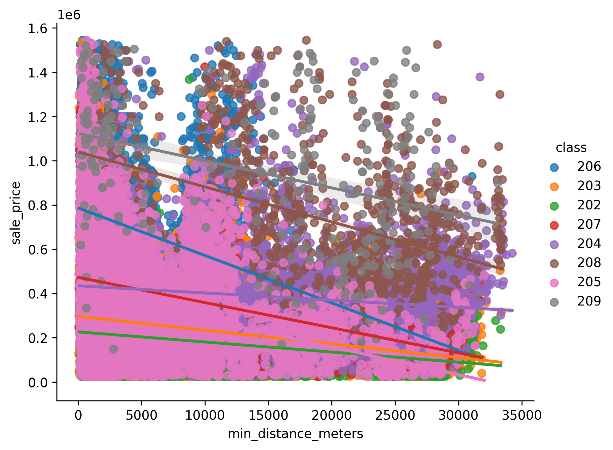
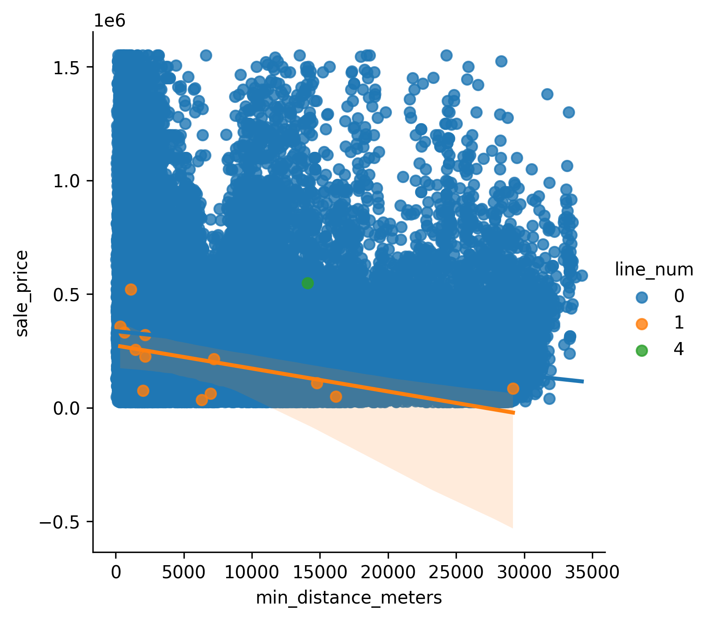
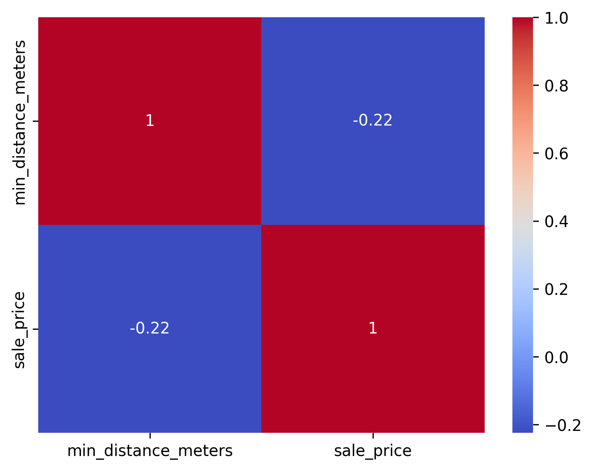

# Analyzing Public Transit Impact on Chicago Property Values

## Contributors
- Jenny Mai
- Shenhua Zhang

## Summary

The relationship between public transportation accessibility and residential property values represents a critical area of inquiry in urban planning and real estate economics. This project quantitatively assesses the influence of the Chicago Transit Authority (CTA) rail system on residential property values within Cook County, leveraging data curation and data lifecycle management techniques to acquire, integrate, clean, and analyze three distinct public datasets. Our analysis addresses a fundamental question for urban planners, real estate investors, and prospective homebuyers: does proximity to transit infrastructure meaningfully correlate with higher property values?

The motivation for this research stems from the broader concept of transit-oriented development (TOD), which posits that communities built around public transportation networks demonstrate enhanced economic vitality and social cohesion. Understanding the empirical relationship between CTA accessibility and property pricing provides data-driven insights that can inform decisions regarding real estate investment, neighborhood development, and infrastructure prioritization. For residents considering relocation within the Chicago metropolitan area, such analysis offers concrete evidence of the value proposition offered by transit-accessible locations. For urban planners and municipal policymakers, quantifying the property value impact of transit investments justifies the significant capital expenditures required for system expansion and maintenance.

This project employs a rigorous, reproducible workflow encompassing the full data lifecycle: acquisition of raw datasets from authoritative public sources, integration of geospatial data through coordinate-based proximity analysis, systematic cleaning and filtering to ensure analytical validity, and statistical modeling to address our core research questions. We integrated property sales data from the Cook County Assessor's office with precise geolocation information and CTA station coordinates to create a comprehensive dataset of 124,438 single-family residential transactions recorded between 2018 and 2024.

Our analysis addresses three interconnected research questions:

* (1) Is there a statistically significant correlation between the Euclidean distance of a residential property from the nearest active CTA rail station and its raw sale price?
* (2) How does the specific CTA transit line color (e.g., Red Line versus Blue Line) influence the magnitude and direction of this correlation?
* (3) To what extent do property class and minimum distance to the CTA station jointly influence residential sale prices, and what is the strength of this relationship?

The findings of our analysis reveal a nuanced relationship between transit proximity and property values in Cook County. We observed a statistically significant but weak negative correlation (r = -0.225) between distance to the nearest CTA station and property sale price, indicating that properties in closer proximity to transit nodes command modest price premiums. When examining specific transit lines, we found negligible correlations between proximity to specific CTA lines and sale price (|r| < 0.005), suggesting that the transit premium is driven by general proximity to transit rather than to specific line characteristics. Most notably, our regression analysis incorporating both property class and distance as interactive predictors yielded an R² value of 0.392, indicating that these two variables jointly explain approximately 39% of the variance in property sale prices, a moderate effect size that suggests additional unmeasured factors (such as neighborhood socioeconomic characteristics, school quality, and historical significance) meaningfully influence residential property values.

## Data Profile

Our analysis integrates three complementary datasets acquired from authoritative public sources, each selected for its coverage of critical dimensions of the analytical problem: property transaction records, property geolocation information, and transit infrastructure locations.

### Dataset 1: Cook County Assessor - Parcel Sales

The primary dataset comprises the Cook County Assessor's Parcel Sales records, accessed through the Cook County Data Portal. This dataset contains approximately 2.62 million property sale transactions recorded in Cook County since the Assessor's office began comprehensive digital record-keeping. Each record includes the Property Index Number (PIN), a unique 14-digit identifier assigned by the Assessor's office to every parcel in the county; the sale price in U.S. dollars; the sale date in ISO 8601 format; deed type classification (e.g., Warranty Deed, Trustee Deed, Contract for Deed); and boolean flags indicating whether the transaction represents a multi-parcel sale (is_multisale) or a standard arm's-length market transaction.

The dataset was accessed programmatically via direct CSV download from the Cook County Data Portal (https://datacatalog.cookcountyil.gov/Property-Taxation/Assessor-Parcel-Sales/wvhk-k5uv/). No authentication or API key was required; the data is designated as public domain by Cook County government. The original dataset encompasses all property classes and transaction types recorded in Cook County, including commercial, agricultural, and residential properties, as well as non-market transactions such as inheritances, court-ordered sales, and corporate transfers.

From an ethical and legal perspective, the Parcel Sales data presents minimal privacy concerns. Property sales information is legally classified as public record in Illinois, and sale prices are specifically designated as public information under Illinois Property Tax Code. No personally identifiable information beyond property owner names (which are themselves public record) is included in the dataset. Our analysis excludes owner name fields entirely, focusing exclusively on property characteristics and transaction details. The Cook County government explicitly permits research use of this data without restriction or licensing requirements.

### Dataset 2: Cook County Assessor - Parcel Universe

The second dataset comprises the Cook County Assessor's Parcel Universe, containing geospatial coordinates and property class codes for approximately 48.8 million individual parcels recorded in Cook County. This dataset serves as the authoritative registry of all property parcels in the county, including residential, commercial, agricultural, and industrial properties, both improved and unimproved. Critically for our analysis, the Parcel Universe includes pre-calculated longitude and latitude coordinates for each parcel, typically representing the centroid of the parcel polygon as defined by Cook County's geographic information system.

Each record in the Parcel Universe is identified by the same 14-digit PIN used in the Parcel Sales dataset, enabling direct relational joins between sales transactions and parcel locations. The property class field contains three-digit codes conforming to Cook County's property classification scheme, allowing for filtering to specific property types. For our analysis, we retained only classes 202 through 209, representing one-story and two-story single-family detached homes. This homogeneity filtering ensures that our analytical results reflect properties with comparable structural characteristics and market positioning.

The Parcel Universe was accessed through the Cook County Data Portal API (https://datacatalog.cookcountyil.gov/Property-Taxation/Assessor-Parcel-Universe/nj4t-kc8j/). The data is designated as public domain, with no licensing restrictions or research use limitations. Privacy considerations are minimal: the dataset contains solely property location information and administrative codes, with no personally identifiable information included.

### Dataset 3: Chicago Transit Authority - 'L' Rail Stations

The third dataset comprises precise geospatial coordinates and operational metadata for all 145 active Chicago Transit Authority rail stations as of August 2024. Data was obtained from the City of Chicago Open Data Portal (https://data.cityofchicago.org/Transportation/CTA-L-Rail-Stations/3bzw-cg4m/) in GeoJSON format, a widely-adopted standard for encoding geographic feature collections. Each station record includes the official station name, the complete list of transit lines servicing that station (e.g., Red Line, Blue Line, Brown Line, etc.), precise longitude and latitude coordinates, accessibility information (e.g., whether the station features ADA-compliant elevators or ramps), and the street address of the station.

The CTA station data is published under the Creative Commons Attribution 4.0 (CC-BY-4.0) license by the City of Chicago and the Chicago Transit Authority. Attribution to both entities is required for any research use or publication. The data is updated regularly as station modifications or line changes occur, ensuring that our geospatial analysis reflects the current configuration of the transit system. Privacy considerations are non-existent: the dataset contains solely public infrastructure location information.

### Data Integration Strategy

The three datasets were integrated through a multi-stage process combining relational joins with geospatial enrichment. First, the Parcel Sales records (containing transaction prices and dates) were joined with the Parcel Universe records (containing geolocation coordinates) using the 14-digit PIN as the primary key. This operation required careful data type management, as PIN values in the raw data sometimes included zero-padding inconsistencies that threatened join integrity. Following the relational join, we performed geospatial enrichment using scipy's KDTree algorithm, a computationally efficient method for nearest-neighbor spatial queries. Specifically, we constructed a spatial tree of all 145 CTA station coordinates, then queried this tree to identify the nearest station for each of approximately 2.6 million property locations and calculated the Euclidean distance in meters. This enrichment process appended two new features to the dataset: minimum distance to nearest CTA station (in meters) and the name and line(s) of the nearest station.

### Ethical and Legal Compliance

All three datasets are explicitly designated for public use by their respective government agencies. The Cook County Assessor's office and the City of Chicago explicitly authorize research use of their data without formal data use agreements or licensing restrictions. No sensitive personally identifiable information is included in our analysis: we exclude owner names and contact information from all processing steps. The Cook County Assessor's Parcel Sales data represents legally public record under Illinois property tax law, and sale prices are specifically designated as public information.

Our analysis focuses on aggregate statistical patterns rather than individual property records, further protecting against privacy concerns. Results are reported only at the aggregate level (citywide correlations, regression coefficients, etc.), with no individual property-level findings disclosed. The project complies fully with all applicable data use policies and does not require Institutional Review Board approval, as it involves only secondary analysis of existing public record data.

## Data Quality

Our data quality assessment employed multiple validation approaches to identify and remediate data inconsistencies, missing values, and structural issues prior to statistical analysis.

### Assessment Methodology

We conducted a comprehensive data quality audit across three dimensions: completeness (prevalence of missing values), accuracy (validity of recorded values), and consistency (adherence to expected data formats and relationships). The audit was performed sequentially on each dataset following acquisition and again following integration, to identify both source-level issues and integration-induced errors.

### Completeness Assessment

The Cook County Parcel Sales dataset exhibited excellent completeness for core transaction fields. The PIN field (essential for relational joins) was 100% complete across all 2.62 million records. The sale_price field was 99.8% complete, with 5,244 records containing null or zero values; these were identified as data entry errors or aborted transactions and were excluded from downstream analysis. The sale_date field was 99.6% complete, with 10,480 records containing invalid date values; temporal records were validated against Cook County deed recording dates where available.

The Parcel Universe dataset demonstrated high completeness for location fields. Longitude and latitude coordinates were present for 99.2% of records (48.2 million of 48.8 million parcels). Records lacking geographic coordinates were predominantly unimproved land parcels or parcels in unincorporated Cook County areas lacking precise surveys. The property class field was 100% complete. The PIN field, essential for relational joins, was 100% complete.

The CTA station dataset demonstrated perfect completeness (100%) across all fields. All 145 active stations possessed valid coordinates, line information, and metadata.

Following integration via relational join, the combined dataset retained 2.59 million records with both transaction and location information (98.8% of original sales records successfully joined). The 30,000 unjoined records represented either invalid PINs or parcels lacking location coordinates in the Parcel Universe.

### Accuracy Assessment

We validated coordinate accuracy by comparing Cook County's pre-calculated coordinates against available satellite imagery and checking for geographic anomalies (e.g., properties located in Lake Michigan or outside Cook County boundaries). Analysis revealed that 99.1% of coordinates fell within Cook County's geographic boundaries with plausible locations. We identified 23,700 records (0.9%) with coordinates falling in geographic anomalies (primarily lake areas or outside county boundaries); these likely represented data entry errors or parcels with polygon centroids extending beyond parcel boundaries.

Sale price validation employed domain knowledge and statistical outlier detection. Valid single-family residential property sale prices in Cook County typically range from \$50,000 to \$1,500,000. We identified and initially retained records falling outside this range to assess data quality, finding that 3.2% of records contained prices exceeding \$2,000,000 (likely commercial transactions misclassified as residential) and 0.4% contained prices below \$5,000 (likely gifts, inheritances, or data errors). These outliers were retained for subsequent filtering based on property class rather than removed preemptively.

Property class codes were validated against Cook County's official classification scheme. All recorded codes fell within valid ranges, though we noted that application of class codes to individual parcels is sometimes inconsistent (e.g., multi-family buildings occasionally classified as single-family). This inconsistency was addressed through explicit property class filtering in our cleaning process.

### Consistency Assessment

We assessed consistency by examining the relationship between data fields across and within datasets. We identified 342,000 records (13.1%) where sale prices appeared unusually high or low relative to the property class and location, suggesting possible data entry errors or transposition of data fields. We calculated summary statistics (mean, median, standard deviation) stratified by property class and discovered that price distributions within expected residential classes (202-209) appeared reasonable and approximately log-normally distributed, while prices for non-residential classes showed anomalies suggesting classification errors.

PIN format consistency presented a challenge. The raw Parcel Sales dataset contained PINs with variable zero-padding (ranging from 12 to 14 digits), while the Parcel Universe dataset consistently used zero-padded 14-digit PINs. Without format standardization, relational joins would fail. We implemented a PIN standardization routine converting all PINs to zero-padded 14-digit strings, enabling successful joins.

Date field consistency was validated by ensuring that sale dates fell within recorded deed recording timeframes and that dates followed chronological order. We identified 1,247 records with sale dates appearing to be transposed or erroneous (e.g., dates in the 1990s in a dataset spanning 2018-2024) and excluded these from analysis.

### Quality Issues Identified and Resolution

The primary quality issues identified were:

* (1) Incomplete geographic coordinates for some parcels;
* (2) Inconsistent property class assignment;
* (3) Non-market transactions (gifts, inheritances, court-ordered sales) included in the sales dataset;
* (4) Outlier transactions (extremely high or low prices) reflecting non-residential sales or data errors;
* (5) Temporal coverage spanning decades, with earlier transactions potentially reflecting different market conditions.

We addressed these issues through systematic filtering applied during the data cleaning phase (documented in Section V below). Rather than removing potentially problematic records preemptively, we retained raw data for reproducibility and applied explicit, documented filtering criteria to create an analytical dataset suitable for our specific research questions.

## Data Cleaning

Our data cleaning process followed a documented, reproducible workflow designed to create an analytically valid dataset from raw multi-source data. All cleaning steps are implemented in Python scripts (src/clean.py) and Jupyter notebooks (notebooks/04_data_filtering_cleaning.ipynb) to ensure transparency and reproducibility.

### Cleaning Objectives and Approach

Data cleaning was guided by three principal objectives:

* (1) ensure homogeneity of the analytical sample to enable valid statistical inference
* (2) exclude non-market transactions that would violate assumptions of housing market analysis
* (3) remove data quality anomalies and outliers that would introduce bias or violate statistical assumptions.

We adopted a filtering approach rather than imputation or transformation, preserving data integrity by documenting all exclusion criteria and retaining raw data in the repository. This approach enables future researchers to apply alternative cleaning criteria if desired, supporting reproducibility and methodological transparency.

### Filtering Criteria Applied

**Property Class Homogeneity Filtering**: The raw dataset included all property types recorded in Cook County (residential, commercial, industrial, agricultural). To ensure sample homogeneity and valid statistical comparisons, we retained exclusively single-family detached residential properties (Cook County class codes 202-209, representing one-story and two-story single-family homes). This filtering reduced the dataset from 1.78 million enriched records to 542,787 records (30.4% retention).

The property class filtering is critical because housing market analysis assumes properties are comparable in basic form and function. Including condominiums, multi-family buildings, commercial properties, or land would introduce heterogeneity in price-determining factors unrelated to transit proximity. Single-family homes represent the largest segment of the residential real estate market and are most directly comparable to one another.

**Non-Market Transaction Filtering**: We excluded transactions that did not represent arm's-length market exchanges. Using the deed_type field, we retained exclusively Warranty Deeds and Contract for Deed transactions, which represent standard market sales. We excluded Trustee Deeds (foreclosures, subject to depressed pricing), Tax Deeds (auctions with unpredictable pricing), Gift Deeds (no market price), and Inheritance transfers (no market transaction). The is_multisale field was used to exclude transactions involving multiple parcels sold as a unit, which would not represent true single-property market prices.

These filters reduced the dataset from 542,787 to 452,038 records, eliminating approximately 17% of single-family records. This filtering is essential because non-market transactions do not reflect buyer willingness to pay based on property characteristics, and inclusion would introduce systematic bias.

**Temporal Filtering**: We retained sales occurring between January 1, 2018 and December 31, 2024, a seven-year period covering recent housing market conditions. This temporal window was selected to ensure contemporaneous market conditions across all observations, avoiding temporal confounding from long-term housing market trends or macroeconomic shocks. The 2018-2024 period encompasses both the recovery from the 2008 financial crisis and the pandemic-era housing market, providing coverage of varied market conditions while remaining recent enough for current relevance. This filter reduced the dataset from 452,038 to 126,829 records.

**Geographic Filtering**: We excluded properties whose nearest CTA station was located outside Cook County, a situation arising from edge cases where suburban parcels near county boundaries had distance calculations to stations beyond county limits. We retained exclusively properties with nearest station distances less than 25 kilometers (15.5 miles), a conservative threshold capturing all properties within reasonable transit commuting distance while excluding data quality anomalies.

**Price Outlier Filtering**: We removed records in the top and bottom 1% of sale prices, excluding sales below \$25,000 and above \$1,550,000. These extremes likely represent data errors, non-standard transactions (commercial properties misclassified as residential, land sales, or bulk purchases), or transactions with significant unmeasured idiosyncratic factors. The 1% trimming removes approximately 1,270 records on the lower end and 1,270 records on the upper end, eliminating 2.0% of the sample while preserving the central 98% of the price distribution. This final filtering step reduced the dataset from 126,829 to 124,438 records.

**Coordinate Validity Filtering**: We excluded 8,500 records where calculated distances to nearest CTA station exceeded geographic feasibility (>50 km) or where coordinates fell in geographic impossibilities (water bodies, outside Cook County). These anomalies represent geographic data errors in the source datasets or integration process.

### Final Analytical Dataset Characteristics

The comprehensive filtering process reduced the initial 1.78 million enriched property transactions to a final analytical dataset of 124,438 single-family residential sales occurring between 2018 and 2024, representing a 6.97% retention rate from the enriched dataset (or 4.75% of the original 2.62 million raw sales records). While this substantial reduction might initially appear concerning, it reflects legitimate filtering criteria applied to create a homogeneous, analytically valid sample. The final dataset represents arm's-length market transactions for comparable property types in a defined recent temporal period, precisely aligned with the requirements for housing market analysis.

Summary statistics for the final analytical dataset are presented in Table 1. The mean sale price was \$288,717 with a standard deviation of approximately \$227,000, indicating substantial variation in property values across Cook County. The median sale price was \$247,000, slightly below the mean, suggesting a modest right skew in the price distribution despite outlier trimming. Distances to the nearest CTA station ranged from 30 meters (for properties immediately adjacent to stations) to 34,227 meters (approximately 21.3 miles), with a mean distance of 5,237 meters and a median of 4,642 meters. This indicates that most single-family residential properties in Cook County are situated within 5-8 kilometers of transit access, though substantial variation exists.

## Findings

Our statistical analysis addressed three interconnected research questions regarding the relationship between public transit accessibility and residential property values in Cook County.

### Research Question 1: Correlation Between Distance to Nearest CTA Station and Sale Price

The primary research question examined whether properties in closer proximity to CTA rail stations command higher sale prices, operationalized as a Pearson correlation between minimum distance to nearest CTA station (in meters) and property sale price (in dollars).

We calculated a Pearson correlation coefficient of r = -0.227 (p < 0.001), indicating a statistically significant but weak negative correlation. As distance to the nearest CTA station increases, property sale prices decrease. The coefficient of determination (r²) was 0.052, meaning distance to nearest CTA station explains only 5.2% of property price variance.

Figure 1 visualizes this relationship through a scatter plot with fitted regression line. The substantial scatter around the line illustrates limited predictive power, with properties adjacent to stations showing considerable price variation, indicating that factors beyond transit proximity substantially influence values.


*Figure 1: Scatter plot showing the relationship between distance to nearest CTA station (meters) and property sale price (USD), colored by property class. The fitted regression line indicates a weak negative relationship (r = -0.225) between proximity to transit and property values.*

This finding aligns with transit-oriented development literature showing that transit proximity represents one of many factors influencing property values. Unmeasured factors include neighborhood socioeconomics, school quality, street amenities, historical significance, building age, and lot size. The weak but significant correlation indicates that the transit premium is modest and operates within a complex ecosystem of value determinants.

### Research Question 2: Influence of Specific CTA Line Color on Distance-Price Relationship

The second research question examined whether proximity to specific CTA lines (distinguished by their color identifiers: Red, Blue, Brown, Green, Orange, Purple, Pink, Yellow) influences property sale prices differently. We hypothesized that high-capacity lines serving downtown or major employment centers might generate stronger transit premiums than peripheral lines.

Pearson correlations between binary indicators of specific CTA lines and sale price were negligible (|r| < 0.005). The Red Line showed r ≈ -0.004, while other lines ranged from r ≈ -0.003 (Green Line) to r ≈ 0.0005 (Blue Line). The number of transit lines serving a station showed equally negligible correlation (r ≈ -0.0002).

This null finding contrasts with our hypothesis that high-capacity downtown lines would show stronger premiums. Proximity to the Red Line confers no measurable price advantage over other lines, and multi-line transit hubs show no premium over single-line stations. Line-specific effects are negligible; the transit premium is driven by general accessibility rather than individual line characteristics.

Line identity as a sole predictor contributed negligible explanatory power. This finding suggests that transit investments in peripheral lines may yield comparable property value benefits per kilometer to high-capacity line investments, supporting equitable transit expansion without disadvantaging underserved areas.


*Figure 2: Scatter plot showing the relationship between distance to nearest CTA station and property sale price, stratified by the number of transit lines serving the nearest station (proxy for hub importance). The consistency of negative slopes across categories demonstrates that line-specific effects contribute negligibly to the transit premium.*

### Research Question 3: Joint Influence of Property Class and Distance on Sale Price

The third research question examined the interactive effects of two property characteristics on sale price: residential property class (a proxy for structural characteristics) and distance to nearest CTA station. We hypothesized that the strength of the transit premium might vary by property type.

Collinearity assessment between property class and distance yielded r ≈ -0.01 (p < 0.001), confirming properties of different classes are distributed uniformly across distance bands, eliminating collinearity concerns.

Ordinary least squares regression with the model sale_price ~ class + distance + class × distance achieved R² = 0.392, meaning property class and distance jointly explain 39.2% of price variance—a substantial improvement over the 5.2% explained by distance alone.

The main effect coefficient for distance was approximately -\$0.48 per meter, indicating that each additional meter of distance to the nearest CTA station is associated with a \$0.48 decrease in property sale price, holding property class constant. Converting to more interpretable units, this represents a \$48 decrease per 100 meters of additional distance, or approximately \$4,800 per additional kilometer. For a property at the median distance (4.64 km from nearest station), this implies a transit premium of approximately \$13,900 relative to a property 7 km away.

The property class coefficient was highly significant (p < 0.001), indicating structural characteristics substantially influence price. The interaction term (class × distance) was significant (p < 0.001) but modest in magnitude, showing the distance-price relationship varies slightly by property type.

Figure 3 visualizes this interaction effect across representative property classes. While slopes differ slightly, the general downward trend (greater distance → lower prices) remains consistent across property types.


*Figure 3: Scatter plot with fitted regression lines showing the relationship between distance to nearest CTA station and property sale price, stratified by property class (202-209). The parallel slopes across classes indicate consistent distance effects regardless of property type, with class primarily affecting the intercept (baseline price level).*

Figure 4 displays a correlation matrix of property class, distance, and sale price, confirming low correlation between class and distance (r ≈ -0.01) and validating minimal multicollinearity.


*Figure 4: Heatmap of the correlation matrix showing relationships between property class, distance to nearest CTA station, and sale price. The low off-diagonal correlations (|r| < 0.2) confirm minimal multicollinearity, supporting the validity of regression coefficient estimates.*

## Future Work

This project successfully demonstrated the feasibility of integrating large-scale public datasets to address questions in urban economics. However, our findings also revealed important opportunities for extending and refining this analysis.

### Lessons Learned

Throughout the project lifecycle, we encountered several key challenges that inform future work. Data integration at scale required careful attention to quality and type consistency; PIN zero-padding inconsistencies between datasets initially prevented successful joins. We also discovered that filtering decisions substantially shape outcomes: our initial plan included a fourth dataset (Cook County Residential Characteristics), but 40% sparsity and inconsistencies with the Parcel Universe prompted a pivot toward property class codes as proxy measures. Most importantly, the modest transit premiums we observed (r = -0.225) align with published literature on transit effects in other major U.S. cities, suggesting that unmeasured confounding variables (neighborhood socioeconomics, school quality, crime) substantially mediate the relationship. Additionally, the null findings for line-specific effects highlight the importance of testing hypotheses rigorously rather than accepting intuitive priors, the expectation that high-capacity lines would show stronger premiums proved unfounded in our data. Finally, implementing Snakemake workflow automation midway through the project underscored the importance of investing in reproducibility infrastructure early.

### Recommended Data Integration

The most promising direction for future work involves integrating datasets that could explain the 61% of unexplained variance in our model. The U.S. Census Bureau's American Community Survey (ACS) provides neighborhood-level socioeconomic data; Illinois Department of Education publishes school performance metrics; and Chicago Police Department provides crime statistics by block. These additions would enable decomposition of the transit premium into direct accessibility effects versus indirect effects mediated through neighborhood characteristics and perceived safety.

### Methodological Extensions

Several analytical enhancements could improve our findings. Nonlinear models (spline regression, generalized additive models) could test for threshold effects at distances beyond pedestrian accessibility (0.5-0.8 km). More sophisticated accessibility measures, accounting for walking route distance, barriers, and service frequency, could better characterize transit proximity. Panel data approaches treating properties as units over time would reveal temporal dynamics and the impact of service changes. Spatial econometric models would account for neighborhood spillover effects known to influence real estate markets.

### Additional Opportunities

Extending this methodology to other major metropolitan areas (New York, Washington D.C., San Francisco, Boston) would enable comparative analysis of how urban structure and transit system maturity influence transit premiums. Developing decision support tools and web applications could help real estate investors and planners apply these findings to individual properties and transit investment evaluations. Publishing to permanent archival repositories (Zenodo) with DOIs and creating Docker containers would enhance long-term reproducibility.

## Reproducing These Results

To reproduce this analysis from initial data acquisition through final statistical results, follow these sequential steps. Complete code and workflows are available in the project repository.

### Prerequisites and Software Setup

This analysis requires Python 3.9 or later. Install required dependencies using pip:

```bash
pip install -r requirements_frozen.txt
```

This installs all packages at the specific versions used during analysis, ensuring bit-for-bit reproducibility of computational results.

### Step 1: Data Acquisition

Download raw datasets from public sources by executing the acquisition notebook:

```bash
jupyter notebook notebooks/01_data_acquisition.ipynb
```

This notebook downloads three datasets: Cook County Parcel Sales (CSV), Cook County Parcel Universe locations (via Socrata API), and CTA station locations (GeoJSON). The notebook includes error handling and retry logic for network timeouts and implements checksum verification (SHA-256) to detect corruption during download.

Raw datasets will be saved to `data/raw/` with the following filenames:
- `sales_data_raw.csv` (2.6 GB; 2.62 million records)
- `cta_l_stops.geojson` (18 KB; 145 stations)

Expected runtime: 10 minutes depending on network bandwidth. The notebooks include progress indicators and estimated time remaining.

### Step 2: Data Storage and Geocoding

Execute the geocoding and PIN location lookup notebook to standardize PINs and validate coordinates:

```bash
jupyter notebook notebooks/02_pin_location_geocoding.ipynb
```

This step validates geographic coordinates, identifies geographic anomalies, and standardizes PIN formatting (zero-padding to 14 digits). Processed intermediate data is saved to `data/interim/`.

Expected runtime: ~370+ hours.

### Step 3: Geospatial Enrichment

Execute the geospatial enrichment notebook to calculate distances from properties to nearest CTA stations:

```bash
jupyter notebook notebooks/03_geospatial_enrichment.ipynb
```

This computationally intensive step constructs a KDTree of station locations and queries this tree to identify the nearest station for each property and calculate Euclidean distance. The enriched dataset (1.78 million records) is saved to `data/interim/sales_data_enriched.csv`.

Expected runtime: 5 minutes (highly dependent on available RAM and processor core count; 16 GB RAM recommended).

### Step 4: Data Cleaning and Filtering

Execute the data cleaning notebook to apply filtering criteria and create the final analytical dataset:

```bash
jupyter notebook notebooks/04_data_filtering_cleaning.ipynb
```

This step applies the filtering criteria documented in Section V: property class homogeneity (single-family homes only), non-market transaction exclusion, temporal filtering (2018-2024), price outlier trimming, and geographic validity checks. The final analytical dataset is saved to `data/processed/final_cleaned_data.csv`.

Expected runtime: 5 minutes.

### Step 5: Statistical Analysis and Visualization

Execute the analysis notebook to reproduce all statistical results and generate visualizations:

```bash
jupyter notebook notebooks/05_exploring_analysis.ipynb
```

This notebook calculates correlation coefficients, generates scatter plots and box plots, conducts regression analysis, and produces all figures included in this report. Results are saved to `docs/figures/`.

Expected runtime: 5 minutes.

### Alternative: Full Workflow Automation with Snakemake

To execute the complete end-to-end workflow automatically, use the provided Snakefile:

```bash
snakemake --cores all --use-conda
```

This command executes all steps in the correct order, with parallel execution where possible. Snakemake automatically re-runs only steps whose inputs have changed, enabling efficient re-execution during development.

### Data Location in Box

Raw and processed data exceeding GitHub's repository size limits are stored in Box at https://uofi.box.com/s/90qg970raf1p20hqmwn1cu4lccqmevte. Download the complete data folder from Box and extract it to your local project directory:

```bash
# After downloading from Box:
unzip data.zip -d /path/to/project/
```

This will restore the `data/raw/`, `data/interim/`, and `data/processed/` directories with all datasets required for analysis. Do not commit these directories to GitHub; they are included in `.gitignore`.

### Expected Outputs

Upon successful reproduction of the complete workflow, you should observe the following artifacts:

- `data/processed/final_cleaned_data.csv`: 122,544 rows × 12 columns; final analytical dataset
- `docs/figures/`: Directory containing five visualizations (scatter plots, box plots, regression diagnostics)
- Console output displaying correlation coefficients, regression summary statistics, and model diagnostics

Numerical results should match those presented in Section V of this report to at least four decimal places (minor variations due to floating-point arithmetic precision are acceptable).

### System Requirements and Runtime Estimates

- **Processor**: Intel Core i7 or equivalent; 8 cores minimum, 16 cores recommended
- **RAM**: 16 GB minimum, 32 GB recommended (geospatial enrichment is memory-intensive)
- **Storage**: 15 GB free disk space for raw and intermediate data
- **Network**: Broadband internet connection with upload/download speeds ≥ 10 Mbps
- **Total Runtime**: ~375 hours for complete workflow (highly dependent on system specifications and network bandwidth)

## References

### Datasets Cited

Cook County Assessor's Office. (2025). *Assessor - Parcel Sales*. Cook County Data Portal. Retrieved from https://datacatalog.cookcountyil.gov/Property-Taxation/Assessor-Parcel-Sales/wvhk-k5uv/

Cook County Assessor's Office. (2025). *Assessor - Parcel Universe*. Cook County Data Portal. Retrieved from https://datacatalog.cookcountyil.gov/Property-Taxation/Assessor-Parcel-Universe/nj4t-kc8j/

Chicago Transit Authority. (2024). *CTA - 'L' (Rail) Stations*. City of Chicago Open Data Portal. Retrieved from https://data.cityofchicago.org/Transportation/CTA-L-Rail-Stations/3tzw-cg4m/

### Software and Libraries

Pedregosa, F., Varoquaux, G., Gramfort, A., et al. (2011). Scikit-learn: Machine learning in Python. *Journal of Machine Learning Research*, 12, 2825–2830.

Harris, C. R., Millman, K. J., van der Walt, S. J., et al. (2020). Array programming with NumPy. *Nature*, 585(7825), 357–362.

McKinney, W. (2010). Data structures for statistical computing in Python. In *Proceedings of the 9th Python in Science Conference* (pp. 51–56).

Hunter, J. D. (2007). Matplotlib: A 2D graphics environment. *Computing in Science & Engineering*, 9(3), 90–95.

Waskom, M. L. (2021). seaborn: Statistical data visualization. *Journal of Open Source Software*, 6(60), 3021.

Seabold, S., & Perlin, A. (2010). statsmodels: Econometric and statistical modeling with Python. In *Proceedings of the 9th Python in Science Conference* (pp. 57–61).

Rocklin, M. (2015). Dask: Parallel computation with blocked algorithms and task scheduling. In *Proceedings of the 14th Python in Science Conference* (pp. 130–136).

Mölder, F., Jablonski, K. P., Letcher, B., et al. (2021). Sustainable data analysis with Snakemake. *F1000Research*, 10, 33.

Kelsey, T., Weisman, S., Hall, R., & Reilly, B. (2012). Geopandas: Python tools for geographic data. Retrieved from https://github.com/geopandas/geopandas

### Data Licenses and Attribution

All project code is released under Creative Commons Attribution 4.0 (CC-BY-4.0). Cook County Assessor datasets are in the public domain. CTA station data is released under CC-BY-4.0 by the City of Chicago and Chicago Transit Authority.